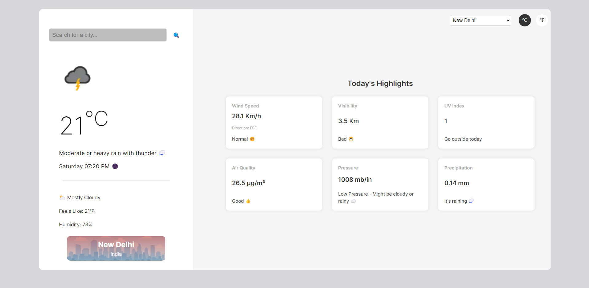
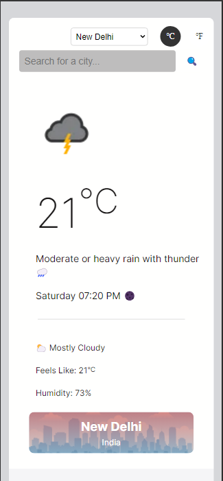

# Weather App

This is a weather application built with React. It allows users to search for weather information by city name. The application displays current weather conditions, including temperature, weather description, and an icon representing the weather condition. It also provides a list of recently searched cities for quick access.

## Features

- Search weather by city name
- Display current weather conditions
- Switch between Celsius and Fahrenheit
- Display a list of recently searched cities
- Error handling for invalid city names

## Installation

Before you start, make sure you have Node.js and npm installed on your machine.

1. Clone this repository:

2. Navigate to the project directory:

3. Install the dependencies:
   `npm install`

## Usage

To start the application, run the following command:
`npm run dev`

### API Usage

API used: [weatherapi](https://www.weatherapi.com)

- Key is required to use the API. You can get a free key by signing up on the website.

### Live Demo

Live demo of the project can be found [here](https://deploy-preview-4--weatherappforzerostic.netlify.app/)

> **Note:** Try the live demo in the morning hours for the best experience. The API key used in the live demo has a limited number of requests per day and is down most of the time. If the live demo is not working, you can run the project locally by following the installation instructions. Also, Keep refreshing. It might work out of blue. 😊

## Screenshots

Here are some screenshots of the Weather App:

## Project structure.

The project structure is as follows:

- `src/`: This directory contains all the React code.
  - `App.jsx`: This is the main component of the application.
  - `components/`: This directory contains all the other React components.
    - `InfoCard.jsx`: This component displays a card with weather information.
    - `InfoCards.jsx`: This component displays a list of InfoCard components.
    - `Loader.jsx`: This component displays a loading spinner.
    - `MainWeather.jsx`: This component displays the main weather information and the search box.
    - `RecentInputs.jsx`: This component displays a dropdown list of recently searched cities.
    - `TemperatureFlipper.jsx`: This component displays two buttons to switch between Celsius and Fahrenheit.
  - `helpers/`: This directory contains helper functions.
    - `weatherFetcher.js`: This file contains a function to fetch weather data from the API.
- `public/`: This directory contains the public assets of the application.
  - `index.html`: This is the main HTML file.
- `package.json`: This file contains the list of npm dependencies.
- `vite.config.js`: This file contains the configuration for Vite.

### License

This project is licensed under the MIT License.
